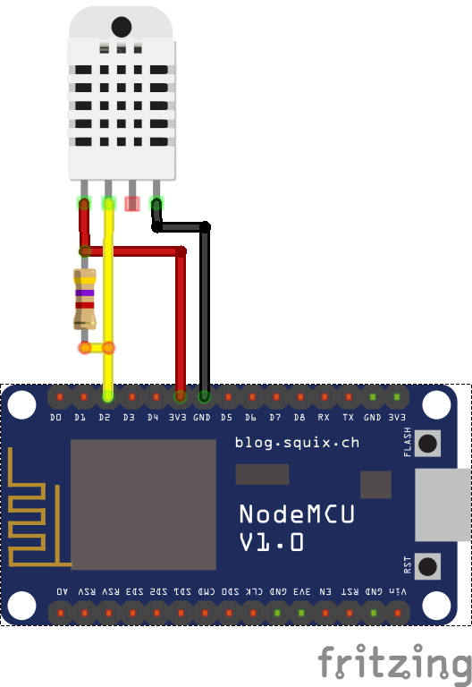

# Iot with MQTT + DHT Temperature and Humidity Sensors Using ESP8266 Modules (NODEMCU)
This project gives a simple way to deploy temperature and humidity sensors around your house using cheap components and the MQTT protocol.

[Original Project - corbanmailloux](https://github.com/corbanmailloux/esp-mqtt-dht)

The sensor publishes to 2 MQTT topics:
- Temperature topic (example: `home/room/temperature`): The sensor publishes the temperature in Celsius (example: `25.10`).
- Humidity topic (example: `home/room/humidity`): The sensor publishes the relative humidity in percent (example: `37.40`).

### ESP8266 Install (Arduino IDE)
 - Installing the ESP8266 Arduino Addon https://learn.sparkfun.com/tutorials/esp8266-thing-hookup-guide/installing-the-esp8266-arduino-addon

### Additional Libraries
- DHT Sensor Library https://github.com/adafruit/DHT-sensor-library
- MQTT Client Library https://github.com/knolleary/pubsubclient

### Android MQTT Client
- IoT MQTT Dashboard https://play.google.com/store/apps/details?id=com.thn.iotmqttdashboard

